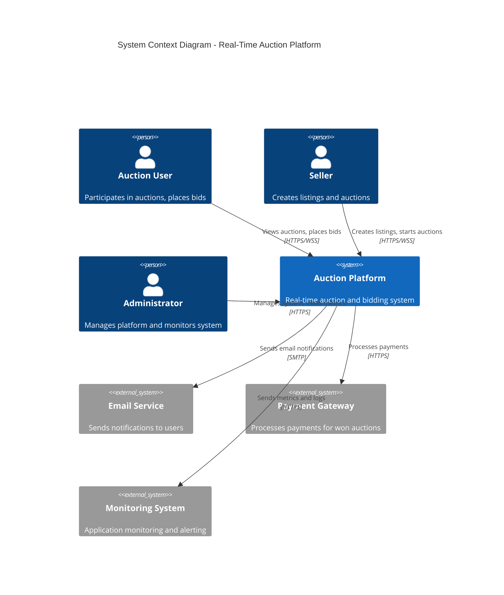
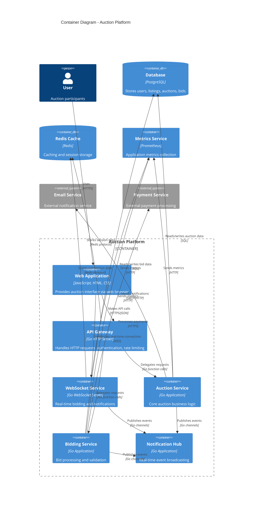
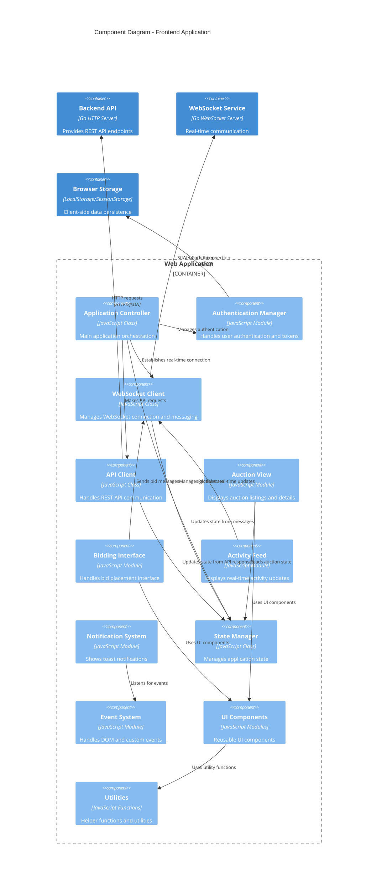
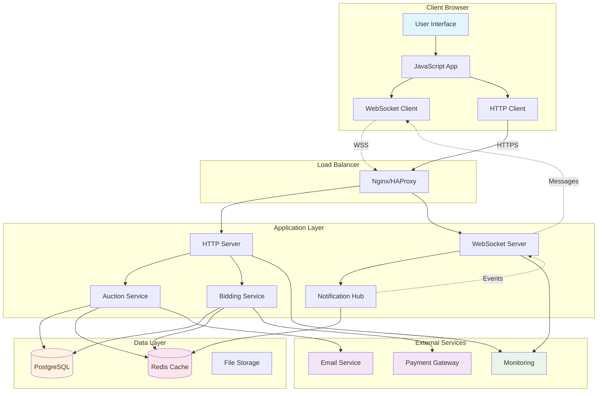
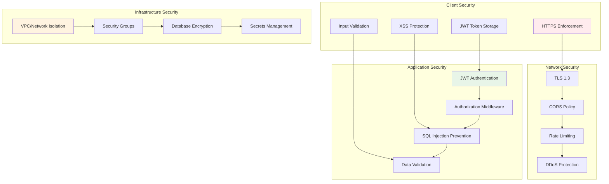
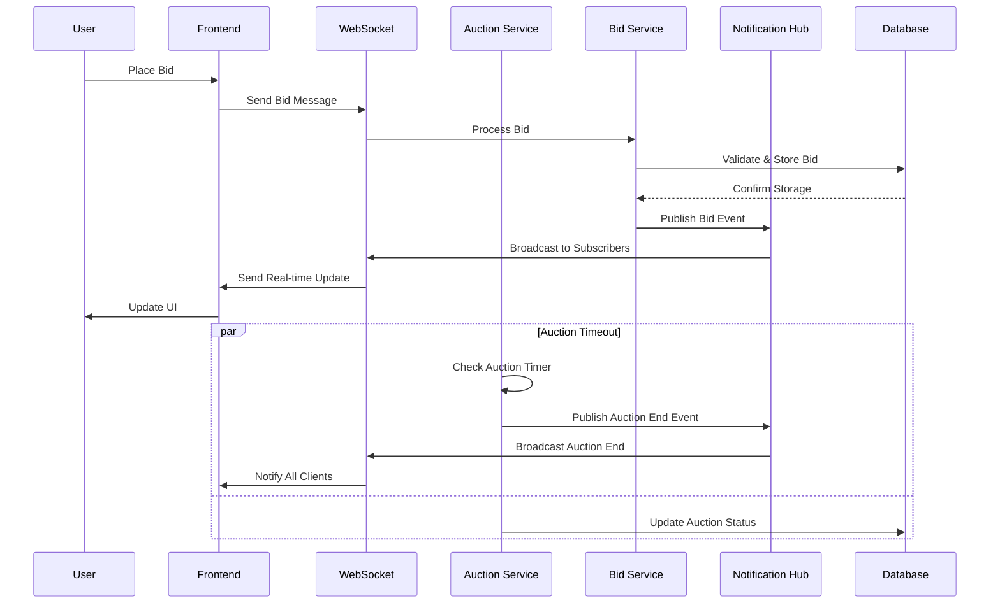

# C4 Architecture Diagrams

This document provides C4 model architecture diagrams for the Real-Time Auction Microservice platform. The C4 model consists of Context, Container, Component, and Code diagrams that provide different levels of abstraction.

## System Context Diagram (Level 1)



## Container Diagram (Level 2)



## Component Diagram (Level 3) - Backend Services

```mermaid
C4Component
    title Component Diagram - Backend Services

    Container_Boundary(api_gateway, "API Gateway") {
        Component(auth_middleware, "Authentication Middleware", "Go Middleware", "JWT token validation")
        Component(rate_limiter, "Rate Limiter", "Go Middleware", "Prevents API abuse")
        Component(cors_handler, "CORS Handler", "Go Middleware", "Handles cross-origin requests")
        Component(http_router, "HTTP Router", "Go HTTP Handler", "Routes requests to services")
    }

    Container_Boundary(auction_service, "Auction Service") {
        Component(auction_handler, "Auction Handler", "Go HTTP Handler", "Handles auction HTTP requests")
        Component(auction_domain, "Auction Domain", "Go Domain Model", "Auction business rules and entities")
        Component(auction_repository, "Auction Repository", "Go Interface", "Auction data access")
        Component(timeout_manager, "Timeout Manager", "Go Service", "Manages auction timeouts")
    }

    Container_Boundary(bid_service, "Bidding Service") {
        Component(bid_handler, "Bid Handler", "Go HTTP Handler", "Handles bid HTTP requests")
        Component(bid_domain, "Bid Domain", "Go Domain Model", "Bidding business rules and validation")
        Component(bid_repository, "Bid Repository", "Go Interface", "Bid data access")
        Component(bid_validator, "Bid Validator", "Go Service", "Validates bid rules and constraints")
    }

    Container_Boundary(websocket_service, "WebSocket Service") {
        Component(ws_handler, "WebSocket Handler", "Go WebSocket Handler", "Manages WebSocket connections")
        Component(connection_hub, "Connection Hub", "Go Service", "Manages active connections")
        Component(message_router, "Message Router", "Go Service", "Routes WebSocket messages")
        Component(subscription_manager, "Subscription Manager", "Go Service", "Manages auction subscriptions")
    }

    Container_Boundary(notification_service, "Notification Hub") {
        Component(event_publisher, "Event Publisher", "Go Service", "Publishes domain events")
        Component(event_subscriber, "Event Subscriber", "Go Service", "Handles domain events")
        Component(notification_dispatcher, "Notification Dispatcher", "Go Service", "Dispatches notifications to clients")
    }

    ContainerDb(database, "PostgreSQL Database", "Database", "Persistent data storage")
    ContainerDb(redis, "Redis Cache", "Cache", "Session and temporary data")

    Rel(http_router, auction_handler, "Routes auction requests")
    Rel(http_router, bid_handler, "Routes bid requests")
    
    Rel(auction_handler, auction_domain, "Uses domain logic")
    Rel(auction_domain, auction_repository, "Persists data")
    Rel(auction_domain, timeout_manager, "Manages timeouts")
    
    Rel(bid_handler, bid_domain, "Uses domain logic")
    Rel(bid_domain, bid_repository, "Persists data")
    Rel(bid_domain, bid_validator, "Validates bids")
    
    Rel(ws_handler, connection_hub, "Manages connections")
    Rel(ws_handler, message_router, "Routes messages")
    Rel(message_router, subscription_manager, "Manages subscriptions")
    
    Rel(auction_domain, event_publisher, "Publishes auction events")
    Rel(bid_domain, event_publisher, "Publishes bid events")
    Rel(event_subscriber, notification_dispatcher, "Processes events")
    Rel(notification_dispatcher, connection_hub, "Sends notifications")
    
    Rel(auction_repository, database, "Reads/writes data", "SQL")
    Rel(bid_repository, database, "Reads/writes data", "SQL")
    Rel(connection_hub, redis, "Stores connection state", "Redis")
    Rel(subscription_manager, redis, "Stores subscriptions", "Redis")
```



## Component Diagram (Level 3) - Frontend Application



## Data Flow Diagram



## Deployment Architecture

```mermaid
C4Deployment
    title Deployment Diagram - Production Environment

    Deployment_Node(cdn, "CDN", "CloudFlare") {
        Container(static_assets, "Static Assets", "HTML, CSS, JS", "Frontend assets")
    }
    
    Deployment_Node(load_balancer, "Load Balancer", "AWS ALB") {
        Container(lb, "Application Load Balancer", "AWS ALB", "Distributes traffic")
    }
    
    Deployment_Node(web_tier, "Web Tier", "AWS ECS Fargate") {
        Deployment_Node(web_cluster, "Web Cluster", "ECS Cluster") {
            Container(frontend_service, "Frontend Service", "Go HTTP Server", "Serves web application")
            Container(api_service, "API Service", "Go HTTP Server", "REST API endpoints")
            Container(websocket_service, "WebSocket Service", "Go WebSocket Server", "Real-time communication")
        }
    }
    
    Deployment_Node(app_tier, "Application Tier", "AWS ECS Fargate") {
        Deployment_Node(app_cluster, "Application Cluster", "ECS Cluster") {
            Container(auction_service, "Auction Service", "Go Microservice", "Auction business logic")
            Container(bid_service, "Bidding Service", "Go Microservice", "Bid processing")
            Container(notification_service, "Notification Service", "Go Microservice", "Event handling")
        }
    }
    
    Deployment_Node(data_tier, "Data Tier", "AWS RDS & ElastiCache") {
        ContainerDb(postgres, "PostgreSQL", "AWS RDS PostgreSQL", "Primary database")
        ContainerDb(redis, "Redis", "AWS ElastiCache", "Caching and sessions")
    }
    
    Deployment_Node(monitoring, "Monitoring", "AWS CloudWatch") {
        Container(metrics, "Metrics", "CloudWatch Metrics", "Application metrics")
        Container(logs, "Logs", "CloudWatch Logs", "Centralized logging")
        Container(alarms, "Alarms", "CloudWatch Alarms", "Monitoring alerts")
    }

    Rel(cdn, load_balancer, "Routes requests", "HTTPS")
    Rel(load_balancer, frontend_service, "Load balances", "HTTP")
    Rel(load_balancer, api_service, "Load balances", "HTTP")
    Rel(load_balancer, websocket_service, "Load balances", "WebSocket")
    
    Rel(api_service, auction_service, "Service calls", "HTTP/gRPC")
    Rel(api_service, bid_service, "Service calls", "HTTP/gRPC")
    Rel(websocket_service, notification_service, "Event streaming", "Message Queue")
    
    Rel(auction_service, postgres, "Database queries", "PostgreSQL")
    Rel(bid_service, postgres, "Database queries", "PostgreSQL")
    Rel(websocket_service, redis, "Session storage", "Redis")
    
    Rel(auction_service, metrics, "Metrics", "CloudWatch API")
    Rel(bid_service, metrics, "Metrics", "CloudWatch API")
    Rel(websocket_service, logs, "Logs", "CloudWatch Logs")
```

## Technology Stack Overview

```mermaid
graph TB
    subgraph "Frontend"
        A[HTML5/CSS3]
        B[Vanilla JavaScript]
        C[WebSocket API]
        D[Fetch API]
    end
    
    subgraph "Backend"
        E[Go 1.21+]
        F[Gorilla WebSocket]
        G[net/http]
        H[database/sql]
    end
    
    subgraph "Data Storage"
        I[PostgreSQL 13+]
        J[Redis 6+]
        K[File System]
    end
    
    subgraph "Infrastructure"
        L[Docker]
        M[Railway/AWS]
        N[Nginx]
        O[CloudFlare]
    end
    
    subgraph "Monitoring"
        P[Prometheus]
        Q[Grafana]
        R[Zap Logger]
        S[CloudWatch]
    end
    
    A --> E
    B --> F
    C --> G
    E --> I
    E --> J
    
    E --> L
    L --> M
    M --> N
    N --> O
    
    E --> P
    P --> Q
    E --> R
    M --> S
```



## Security Architecture



## Event-Driven Architecture



This C4 architecture documentation provides a comprehensive view of the auction platform's structure, from high-level system context down to detailed component interactions, helping stakeholders understand the system at different levels of abstraction.